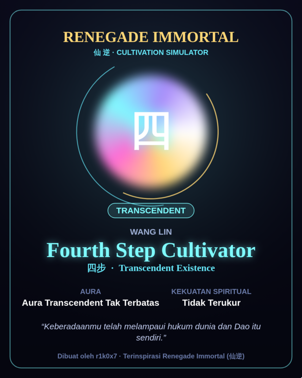
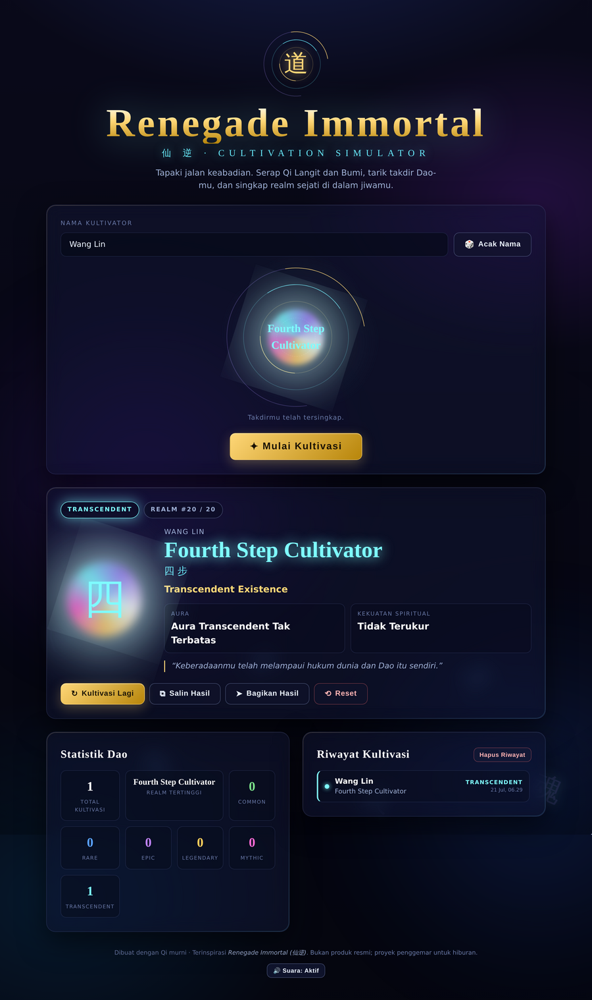
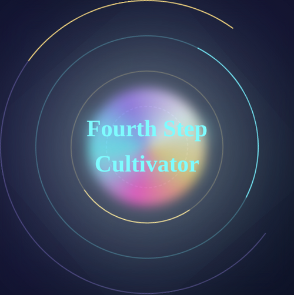
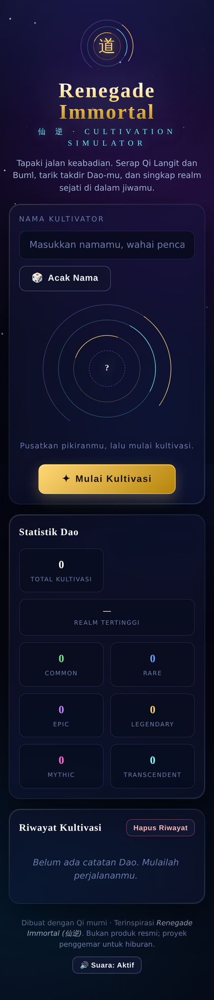

# 仙逆 Renegade Immortal — Cultivation Simulator · Dokumen Penjelasan

Dokumen ini menjelaskan perubahan pada PR: sebuah **website simulator gacha
kultivasi** bertema *Renegade Immortal (Xian Ni)*, dibangun murni dengan
HTML5 + CSS3 + Vanilla JavaScript, dan siap di-deploy ke Vercel tanpa
konfigurasi tambahan.

---

## Latar Belakang

Sebelum perubahan ini, repositori `kultivator` praktis kosong — hanya berisi
`README.md` satu baris. PR ini mengisinya dengan sebuah aplikasi web statis
yang utuh.

Beberapa konsep dasar yang perlu dipahami sebelum menyelami kode:

> [!NOTE]
> **Situs statis** adalah situs yang hanya terdiri dari berkas `.html`, `.css`,
> dan `.js` yang dikirim apa adanya ke browser — tanpa server aplikasi, tanpa
> basis data. Semua logika berjalan di sisi klien (browser pengguna). Karena
> tidak ada backend, tidak ada langkah *build* yang wajib: cukup buka
> `index.html`.

> [!NOTE]
> **Vercel** adalah platform hosting yang mendeteksi jenis proyek secara
> otomatis. Untuk situs statis, ia cukup menyajikan berkas dari root repositori.
> Berkas `vercel.json` berisi `{ "cleanUrls": true }`, yang membuat URL tampil
> tanpa akhiran `.html` (mis. `/about` alih-alih `/about.html`).

> [!IMPORTANT]
> **Weighted random (acak berbobot)** adalah inti dari sebuah sistem *gacha*.
> Alih-alih setiap hasil memiliki peluang sama, tiap hasil diberi *bobot*.
> Hasil dengan bobot besar sering muncul; hasil berbobot kecil menjadi langka.
> Di sinilah "sensasi" gacha berasal — realm tertinggi (*Fourth Step Cultivator*)
> hanya punya peluang **0,005%**.

Keputusan penempatan berkas: seluruh berkas situs diletakkan di **root**
repositori (bukan di dalam subfolder `renegade-immortal-cultivation/` seperti
sketsa awal). Alasannya, Vercel men-deploy dari root secara bawaan, sehingga
persyaratan "siap deploy tanpa modifikasi tambahan" terpenuhi tanpa perlu
mengatur *Root Directory* di dasbor Vercel.

---

## Intuisi

Kunci desain aplikasi ini: **satu tabel data menggerakkan segalanya.**

Seluruh dunia permainan diringkas menjadi satu array `REALMS` berisi 20 objek.
Tiap objek adalah satu tingkat kultivasi lengkap dengan atribusinya:

```js
{
  step: 4, name: 'Nascent Soul', cn: '婴变',
  weight: 12,            // bobot peluang (%)
  rarity: 'Rare',
  auraClass: 'aura-gold',
  auraName: 'Aura Emas',
  title: 'Tetua',
  power: [1000000, 9999999],
  glyph: '婴',
  lore: 'Jiwamu telah lahir kembali dan mampu meninggalkan tubuh fisik.'
}
```

Ketika pengguna menekan **Mulai Kultivasi**, alurnya sederhana:

1. Pilih satu realm memakai weighted random → menghasilkan, misalnya,
   `Nascent Soul`.
2. Tampilkan animasi "berputar" 2–3 detik yang menampilkan realm acak setiap
   80–120 ms untuk membangun ketegangan.
3. Kunci hasil akhir, lalu tampilkan kartu hasil dengan aura, gelar, kekuatan,
   dan lore-nya.

> [!NOTE]
> **Analogi tiket.** Bayangkan sebuah kotak berisi 99 tiket (total bobot).
> `Condensation` memiliki 20 tiket, sementara `Fourth Step Cultivator` hanya
> 0,005 tiket. Kita mengambil satu angka acak antara 0–99, lalu berjalan
> menuruni daftar sambil mengurangi bobot hingga angka itu habis. Realm tempat
> angka "habis" adalah pemenangnya. Semakin banyak tiket, semakin besar peluang.

Contoh konkret dengan data dummy: jika `Math.random()` mengembalikan `0.999999`,
maka `ticket = 0.999999 × 99 ≈ 98.99`. Angka ini nyaris melebihi seluruh bobot,
sehingga baru "habis" di entri terakhir — `Fourth Step Cultivator`. Itulah cara
kita menguji realm terlangka secara deterministik (lihat bagian Verifikasi).

---

## Kode

Perubahan terbagi menjadi tujuh kelompok. Semua logika ada di `script.js`,
seluruh tampilan di `style.css`, dan struktur di `index.html`.

### 1. Model data (`REALMS`)

Array 20 realm menjadi sumber kebenaran tunggal. Konstanta turunan seperti
`TOTAL_WEIGHT` dihitung sekali:

```js
const TOTAL_WEIGHT = REALMS.reduce((sum, r) => sum + r.weight, 0); // = 99
```

Kekuatan direpresentasikan sebagai rentang `[min, max]`, atau string khusus
`IMMEASURABLE` ("Tidak Terukur") untuk realm *Heaven's Blight* ke atas.

### 2. Weighted random (`rollRealm`)

```js
function rollRealm() {
  let ticket = Math.random() * TOTAL_WEIGHT;
  for (const realm of REALMS) {
    ticket -= realm.weight;
    if (ticket <= 0) return realm;
  }
  return REALMS[0]; // fallback aman
}
```

Karena kita membagi terhadap `TOTAL_WEIGHT`, distribusi tetap benar meski jumlah
bobot bukan tepat 100 (di sini 99).

### 3. Alur animasi gacha

`startCultivation()` menentukan hasil akhir **lebih dulu**, lalu menjalankan
animasi kosmetik menggunakan `requestAnimationFrame`. Setiap 80–120 ms sebuah
realm acak ditampilkan sebagai *preview*; setelah 2–3 detik `finishCultivation()`
mengunci hasil sebenarnya. Memisahkan "hasil" dari "animasi" membuat peluang
tetap adil — animasi murni tampilan.

### 4. Render & tema rarity (CSS)

Warna hasil ditentukan oleh kelas rarity pada panel (`rarity-legendary`, dst.)
melalui *custom property* `--aura`. Aura diwujudkan sebagai kelas orb — dari
`aura-green` sederhana hingga aura beranimasi seperti `aura-rainbow`,
`aura-lightning`, `aura-galaxy`, dan `aura-infinite` (memakai `conic-gradient`
dan `@keyframes`).

### 5. Latar kosmik (`<canvas>`)

IIFE `cosmicBackground()` menggambar bintang berkelip dan partikel energi
spiritual mengambang pada `<canvas>` penuh layar, plus parallax nebula ringan
mengikuti pointer. Menghormati `prefers-reduced-motion` (menggambar sekali,
lalu diam).

### 5b. Bagikan hasil sebagai gambar

Tombol **Bagikan Hasil** tidak lagi berbagi teks polos, melainkan me-*render*
kartu hasil menjadi gambar PNG memakai **Canvas 2D** (`buildResultCanvas`).
Kartu digambar dari nol: latar kosmik bergradien, orb aura (radial untuk aura
sederhana, `createConicGradient` untuk aura pelangi/galaksi/infinite), glyph,
chip rarity berwarna, nama, realm, aura, kekuatan, lore terbungkus, dan footer
atribusi.

```js
const file = new File([blob], `kultivasi-${slug(realm)}.png`, { type: 'image/png' });
if (navigator.canShare && navigator.canShare({ files: [file] }) && navigator.share) {
  await navigator.share({ files: [file], title, text });   // 1) berbagi berkas
} else {
  downloadBlob(blob, file.name);                            // 2) fallback: unduh
}
```

Jika berbagi berkas tidak didukung, gambar otomatis diunduh; bila render gambar
gagal sama sekali, sistem jatuh ke berbagi/salin teks.

<p align="center">
  
</p>

> [!NOTE]
> Footer situs (dan footer pada kartu gambar) memuat atribusi
> **oleh [r1k0x7](https://github.com/r1k0x7)**.

### 6. Persistensi (`localStorage`)

Statistik dan riwayat disimpan sebagai JSON di `localStorage` melalui pembungkus
`loadJSON`/`saveJSON` yang dibungkus `try/catch` (agar aman bila storage
diblokir). Riwayat dibatasi 10 entri terakhir dengan `history.slice(0, 10)`.

### 7. Manajer audio dengan cadangan

```js
const USE_SOUND_FILES = false; // set true setelah menaruh .mp3 di assets/sounds/
```

Bila file audio belum ada, modul memakai **sintesis WebAudio** (`beep`) sehingga
website tetap bersuara tanpa error dan tanpa request 404. Setelah developer
menaruh berkas nyata dan mengaktifkan flag, pemutaran file dipakai dengan
`beep` sebagai jaring pengaman jika sebuah berkas hilang.

---

## Verifikasi

Perubahan diverifikasi lewat beberapa lapis pemeriksaan otomatis.

**1. Sintaks & validasi berkas.**

```
node --check script.js        → OK
JSON.parse(manifest.json)     → OK
JSON.parse(vercel.json)       → OK
```

**2. Distribusi weighted random (1.000.000 sampel).** Persentase aktual sangat
mendekati bobot yang diharapkan:

| Realm | Diharapkan | Aktual |
|-------|-----------:|-------:|
| Condensation | 20,20% | 20,17% |
| Nascent Soul | 12,12% | 12,11% |
| Nirvana Shatterer | 1,01% | 0,99% |
| Heaven's Blight | 0,71% | 0,70% |
| Fourth Step Cultivator | 0,005% | 0,006% |

Selain itu diperiksa: 20 realm, langkah 1–20 berurutan, semua field wajib ada,
dan komposisi rarity benar (Common 3 · Rare 3 · Epic 3 · Legendary 3 ·
Mythic 4 · Transcendent 4).

**3. Cross-check DOM.** Semua 41 ID yang dirujuk `document.getElementById` di
`script.js` dipastikan ada di `index.html`.

**4. Uji runtime headless (Playwright/Chromium).** Memuat halaman, mengisi nama,
klik *Acak Nama*, klik *Mulai Kultivasi*, menunggu kartu hasil, lalu mengeklik
*Kultivasi Lagi* lima kali. Hasil: fungsi gacha, statistik, dan riwayat bekerja;
**tidak ada error JavaScript**. (Satu-satunya pesan konsol adalah intersepsi TLS
Google Fonts khusus lingkungan sandbox — normal di produksi.)

**5. Bukti visual.**

Hasil rarity tertinggi (*Fourth Step Cultivator*, dipaksa via `Math.random`):



Close-up orb aura (conic-gradient pelangi + lingkaran Dao berputar):



Tampilan mobile (responsif, satu kolom):



### QA manual — langkah demi langkah

1. Jalankan server lokal: `python3 -m http.server 5173`, buka
   `http://localhost:5173`.
2. Ketik nama, atau klik **Acak Nama** → kolom terisi nama gaya Xianxia.
3. Klik **Mulai Kultivasi** → amati animasi berputar ~2–3 detik lalu kartu hasil
   muncul dengan aura, gelar, kekuatan, dan lore.
4. Klik **Kultivasi Lagi** beberapa kali → *Total Kultivasi* dan penghitung
   rarity bertambah; *Riwayat* menampilkan hingga 10 entri terbaru.
5. **Salin Hasil** → tempel ke mana saja untuk memeriksa teks. **Bagikan Hasil**
   → dialog berbagi native (atau fallback menyalin).
6. Muat ulang halaman → statistik, riwayat, dan nama tetap tersimpan
   (localStorage).
7. **Hapus Riwayat** dan **Reset** → mengosongkan data sesuai konfirmasi.
8. Perkecil lebar browser hingga <760px → tata letak berubah menjadi satu kolom.

---

## Alternatif

### Alternatif 1 — Memakai framework (mis. React + Vite)

| Kelebihan | Kekurangan |
|-----------|------------|
| Manajemen state & komponen lebih terstruktur | Melanggar persyaratan eksplisit "tanpa framework" |
| Ekosistem komponen siap pakai | Perlu langkah build; tidak lagi "buka index.html langsung" |
| Skalabilitas untuk fitur besar | Bundle lebih berat untuk aplikasi sekecil ini (*over-engineering*) |

### Alternatif 2 — Gacha di sisi server + papan peringkat global

| Kelebihan | Kekurangan |
|-----------|------------|
| Anti-curang (RNG otoritatif di server) | Memerlukan backend + basis data; bukan lagi situs statis |
| Memungkinkan leaderboard lintas pengguna | Biaya & kompleksitas hosting bertambah |
| Statistik terpusat & tahan reset | Latensi jaringan pada tiap tarikan gacha |

Kedua alternatif merepresentasikan cara ortogonal untuk menyelesaikan masalah;
keduanya sengaja tidak dipilih agar tetap sesuai batasan proyek (statis,
vanilla, nol-konfigurasi).

---

## Orang yang Disarankan untuk Diajak Diskusi

Repositori ini pada dasarnya *greenfield* — satu-satunya commit sebelum PR ini
adalah "Initial commit" oleh pemilik repo (**r1k0x7**). Dengan kata lain, belum
ada pakar domain lain pada basis kode ini.

- **r1k0x7 (pemilik repo)** — sebagai pemilik dan pemberi spesifikasi, orang ini
  memegang konteks penuh atas persyaratan produk (tema, sistem realm,
  probabilitas). Diskusikan dengannya bila ada pertanyaan soal keseimbangan
  peluang atau arah fitur berikutnya.

Karena seluruh kode PR ini dihasilkan oleh AI di atas repo kosong, tinjauan
manusia atas logika weighted random dan aksesibilitas sangat dianjurkan sebelum
merge.

---

## Kuis

Uji pemahamanmu tentang PR ini. Klik tiap toggle untuk melihat jawaban dan
penjelasannya.

**1. Mengapa `finishCultivation()` menentukan realm final SEBELUM animasi
berputar dimulai?**
A. Untuk menghemat memori · B. Agar animasi memengaruhi hasil · C. Agar peluang
tetap adil dan animasi murni kosmetik · D. Karena `requestAnimationFrame`
mengharuskannya

<details>
<summary>Lihat jawaban & penjelasan</summary>

**Jawaban benar: C.**
- **A — salah.** Tidak berkaitan dengan memori.
- **B — salah.** Justru sebaliknya; animasi tidak boleh memengaruhi hasil.
- **C — benar.** Hasil dikunci oleh `rollRealm()` di awal; loop `tick` hanya
  menampilkan preview acak. Ini menjamin distribusi peluang tidak terdistorsi
  oleh timing animasi.
- **D — salah.** `requestAnimationFrame` tidak mensyaratkan hal ini.
</details>

**2. Jika jumlah seluruh bobot adalah 99 (bukan 100), apa dampaknya pada
distribusi?**
A. Semua peluang salah 1% · B. Tidak ada; pembagian terhadap `TOTAL_WEIGHT`
menormalkannya · C. Realm terakhir tidak pernah muncul · D. `rollRealm`
melempar error

<details>
<summary>Lihat jawaban & penjelasan</summary>

**Jawaban benar: B.**
Karena `ticket = Math.random() * TOTAL_WEIGHT`, ambang otomatis berskala terhadap
total sebenarnya. Persentase efektif tiap realm = `weight / 99`. Uji 1 juta
sampel mengonfirmasi kecocokan. Realm terakhir tetap bisa muncul (opsi C salah),
dan tidak ada error (opsi D salah).
</details>

**3. Apa yang terjadi saat website dijalankan tanpa berkas audio `.mp3`?**
A. Muncul error dan gacha berhenti · B. Konsol dibanjiri 404 · C. Website bisu
· D. Suara tetap ada lewat sintesis WebAudio, tanpa 404

<details>
<summary>Lihat jawaban & penjelasan</summary>

**Jawaban benar: D.**
`USE_SOUND_FILES` bernilai `false` secara bawaan, sehingga tidak ada request
berkas (tidak ada 404 — opsi B salah) dan fungsi `beep()` menghasilkan nada
sintetis. Tidak ada error (opsi A salah) dan website tidak bisu (opsi C salah).
</details>

**4. Mengapa berkas situs diletakkan di root repo, bukan di subfolder
`renegade-immortal-cultivation/`?**
A. Agar git lebih cepat · B. Agar Vercel men-deploy tanpa mengatur Root Directory
· C. Karena subfolder dilarang git · D. Untuk menyembunyikan kode

<details>
<summary>Lihat jawaban & penjelasan</summary>

**Jawaban benar: B.**
Vercel men-deploy dari root secara bawaan. Menaruh berkas di root memenuhi
syarat "siap deploy tanpa modifikasi tambahan". Bila di subfolder, pengguna harus
mengatur *Root Directory* di dasbor Vercel. Opsi A, C, dan D tidak relevan.
</details>

**5. Bagaimana riwayat dibatasi hanya 10 entri terakhir?**
A. `history.length = 10` · B. `history.slice(0, 10)` setelah `unshift` entri baru
· C. CSS `max-height` · D. localStorage otomatis membatasi

<details>
<summary>Lihat jawaban & penjelasan</summary>

**Jawaban benar: B.**
Entri baru dimasukkan ke depan dengan `history.unshift(...)`, lalu array
dipangkas dengan `history = history.slice(0, 10)` sebelum disimpan. Opsi C hanya
membatasi tinggi tampilan (bukan jumlah data), dan localStorage tidak membatasi
jumlah entri secara otomatis (opsi D salah).
</details>
